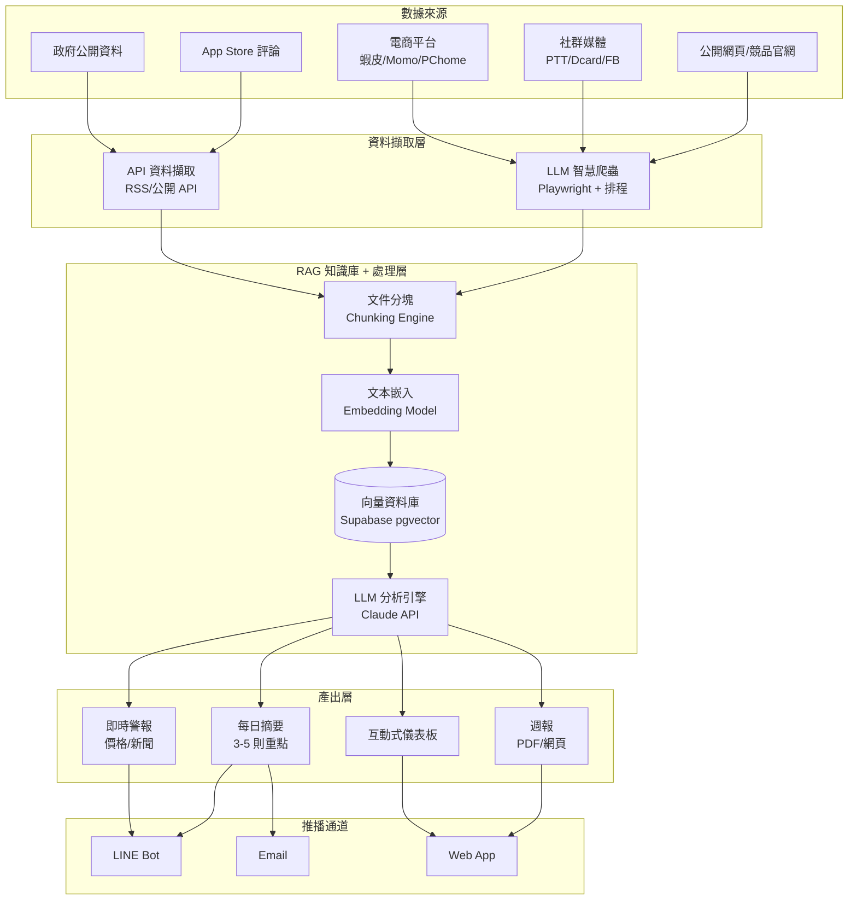
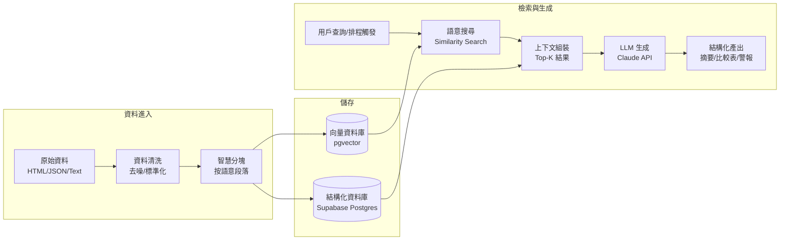
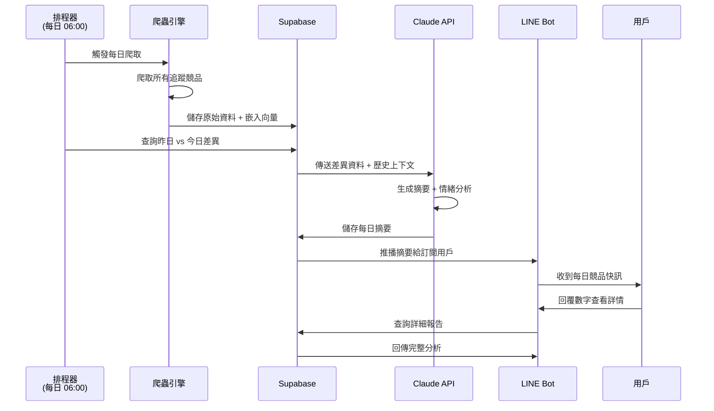
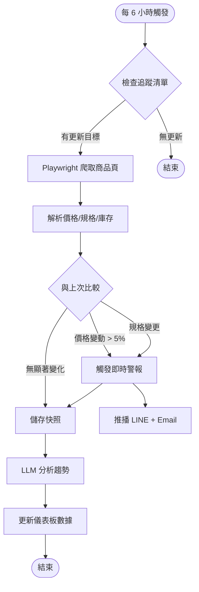
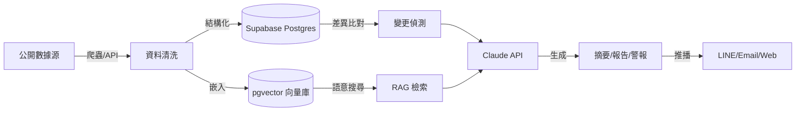

# 技術架構與流程圖
## AI 智能競品分析系統 — CompetitorLens

---

## 1. 系統架構總覽

---

## 2. RAG 知識庫架構

---

## 3. 每日摘要生成流程

---

## 4. RPA 工作流 — 競品價格監測

---

## 5. 技術選型

| 層級 | 技術 | 選擇原因 |
|------|------|---------|
| **前端** | Next.js / Vercel | 快速部署、SSR 支援 |
| **後端 API** | Vercel Serverless Functions | 免維護、自動擴展 |
| **資料庫** | Supabase (Postgres + pgvector) | 結構化 + 向量搜尋一體化 |
| **LLM** | Claude API (Anthropic) | 最佳中文理解、長上下文 |
| **爬蟲** | Playwright + Node.js | 支援動態頁面、JavaScript 渲染 |
| **排程** | Vercel Cron / GitHub Actions | 免費、可靠 |
| **推播** | LINE Messaging API | 台灣用戶最常用的通訊平台 |
| **嵌入模型** | Voyage AI / OpenAI Embeddings | 高品質中文嵌入 |
| **部署** | Vercel Pro | 統一託管、自動 CI/CD |

---

## 6. 資料流架構

