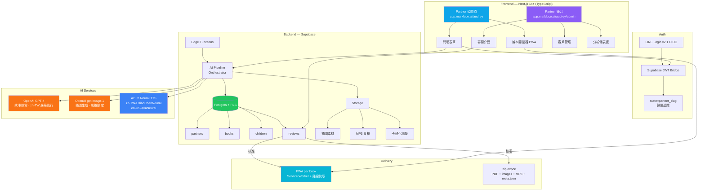
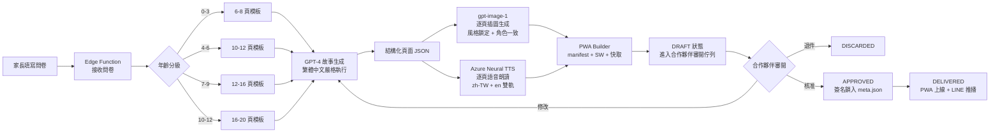
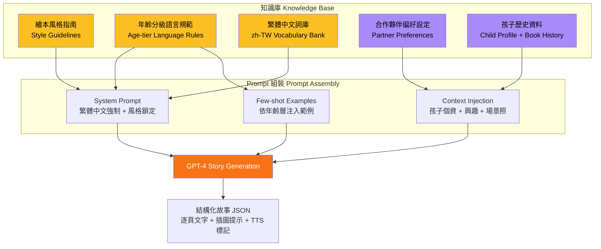
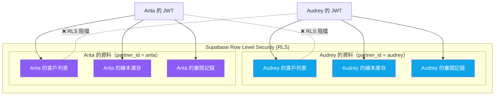

# 五、報告架構 (Deliverables)

> **AIA 經理人 AIPM 班 第一期 · Group 2 · 期末專題交付項目**
> **題目：** 0–12 歲個人化語言繪本，由家長（或老師）親自審閱
> **原始發想：** Audrey（Group 2 組員）｜ **提案整理 / 推動人：** Mark

---

## 一、產品需求文件 (PRD)

> 📌 以下標註 `🤖 AI 協助` 表示該段落由 AI 協助生成或整理；`✍️ 人工撰寫` 為 Mark 或組員原創。

### 1.1 產品定位（一句話）`✍️ 人工撰寫`

> **0–12 歲個人化語言繪本，由家長（或老師）親自審閱。**

AI 草擬每一本書。一位具名的家長或老師逐頁審閱、簽核後才出貨。以 **LINE 登入綁定的 PWA** 交付，支援繁體中文（基礎）+ 英文 + 選購日文。目標市場：台灣，LINE 原生。

### 1.2 核心商業邏輯（不可妥協）`✍️ 人工撰寫`

> **AI 草擬 → 人類審閱 → 出貨。沒有合作夥伴簽核的書，絕不交付。**

這不是流程細節 — 這是商業模式本身。

### 1.3 市場分析 `🤖 AI 協助整理`

#### 目標市場

| 層級 | 對象 | 說明 |
|---|---|---|
| **Mark 的客戶（B2B）** | 合作夥伴（Partner） | 小型經營者，擁有接觸 0–12 歲孩子家長的管道 |
| **合作夥伴的客戶（終端使用者）** | 0–12 歲孩子的家長 | Mark 不直接向家長收費 |

#### 地理市場

- **主要：** 台灣（繁體中文 + LINE 原生）
- **次要：** 香港、海外繁中華僑（美加澳）
- **第三：** 日本（透過 ja-JP 選購語言）

#### 為什麼 LINE-first

- 目標家長生活在 LINE 上（台灣 / 日本原生通訊軟體）
- LINE Login 已整合完成
- 合作夥伴經營自己的 LINE 群組 — Mark 不需要建立社交層
- PWA 可用 LINE 帳號綁定，符合家長對存取權限的直覺

### 1.4 用戶畫像 `✍️ 人工撰寫 + 🤖 AI 協助整理`

#### 合作夥伴畫像（Mark 的客戶）

| 合作夥伴 | 角色 | 管道 | 年齡層覆蓋 | MVP 優先度 |
|---|---|---|---|---|
| **Audrey** | 職場家長 / 學校圈 | 同儕口碑（家長之間互推） | 4–12（自己孩子 6 歲 + 10 歲） | 🎯 **主要 MVP** |
| **Arita** | 兒童英語老師 | 一對一師生 / 家長諮詢 | 4–12（現有學生） | 延伸目標 |
| **Amy** | 新手媽媽 / Mark 的女兒 | 新手家長社交圈（滿月、週歲） | 0–3（自己兒子 1 歲） | 延伸目標 |

#### 終端使用者畫像（合作夥伴的客戶）

- 繁體中文母語
- 希望孩子接觸英文（台灣 / 港 / 海外華僑的強烈需求）
- 部分希望日文作為第二外語
- 重視個人化、可反覆閱讀、離線可用的收藏品
- 願意向信任的合作夥伴（老師、家長朋友）付費 — 不是隨機的 SaaS

### 1.5 功能規格 `🤖 AI 協助整理`

#### 繪本規格

| 年齡層 | 頁數 | 每頁文字量 | 特徵 |
|---|---|---|---|
| **0–3** | 6–8 頁 | 1 個詞/短語 | 超大插圖、極簡字彙 |
| **4–6** | 10–12 頁 | 2–3 句 | 簡單對話、重複角色 |
| **7–9** | 12–16 頁 | 短段落 | 基礎情節弧線 |
| **10–12** | 16–20 頁 | 章節式 | 豐富字彙、主題/寓意 |

#### 語言支援

- **繁體中文（zh-TW / zh-Hant）** — 基礎，永遠包含。絕對不能出現簡體。
- **英文（en）** — 必選附加語言。
- **日文（ja-JP）** — 選購附加語言。

多語言時，每頁同時顯示所有已選語言（堆疊排列），每種語言有獨立朗讀音檔。

#### 生成流程（Generation Pipeline）

1. **故事撰寫** — LLM（嚴格執行繁體中文） → 結構化頁面列表
2. **插圖生成** — gpt-image-1（風格鎖定 + 角色參考圖，維持主角一致性）
3. **語音朗讀** — Azure Neural TTS（繁中用 `zh-TW-HsiaoChenNeural`，英文用 `en-US-AvaNeural`）
4. **排版渲染** — HTML → PDF，文字在插圖外部渲染
5. **PWA 建置** — 每本書獨立 manifest + service worker + 快取資源 + LINE 帳號閘門
6. **打包** — 次要 `.zip` 匯出（PDF + 圖片 + MP3 + meta.json）

#### 審閱工作流（人在迴圈中）— 不可妥協 `✍️ 人工撰寫`

每一本書必須經過指定合作夥伴逐頁審閱並簽核後，才能交付給終端使用者。AI 草擬，合作夥伴簽核。沒有例外。

**狀態機：**

```
[問卷送出]
    │
    ▼
 ┌──────────┐
 │  DRAFT   │  ← AI 撰寫故事、生成插圖、TTS 渲染，PWA/zip 已建置但未交付
 └────┬─────┘
      │
      ▼
 ┌──────────┐
 │ PENDING  │  ← 進入合作夥伴的「待審閱」佇列
 │  REVIEW  │    可：閱讀、聆聽、翻頁、編輯文字、重新生成插圖、更換語音、退件、核准
 └────┬─────┘
      │
      ├── 退件 ──→ DISCARDED（合作夥伴通知家長；Mark 仍收取生成成本）
      │
      ├── 修改 ──→ 回到 DRAFT 重新生成，再次循環
      │
      └── 核准 ──┐
                  ▼
          ┌──────────────┐
          │  APPROVED    │  ← 合作夥伴簽名鎖入 meta.json，credits 頁面生成
          └──────┬───────┘
                 │
                 ▼
          ┌──────────────┐
          │  DELIVERED   │  ← PWA 可安裝、zip 可下載、LINE 推播通知家長
          └──────────────┘
```

#### 歸屬標示（Attribution）`🤖 AI 協助整理`

每本書在三處顯示歸屬：

1. **PWA 封面徽章** — 「審閱：Audrey」+「共同編輯：Luce · AI 共同編輯」
2. **credits 頁** — 完整列出：故事撰寫（AI）、插畫（provider/model）、朗讀（Azure TTS voice）、核准者（partner name, role, signature hash）、生成日期
3. **meta.json** — 結構化資料：`ai_services[]`、`reviewer`、`partner_slug`。核准後不可修改。

#### 照片上傳隱私政策 `✍️ 人工撰寫`

- **不上傳孩子臉部照片。** 主角外觀由 AI 依文字描述生成。
- **只接受環境/場景照片：** 房間、玩具、常去的地方、寵物。
- 環境照片上傳後**立即卡通化處理**，**原始照片立即刪除**（最遲 24h）。
- 只保留卡通化後的場景素材。

### 1.6 合作夥伴模式 `✍️ 人工撰寫`

- **兩層結構：** Mark → 主合作夥伴（Audrey/Arita/Amy）→ 子合作夥伴
- **嚴格兩層：** 不允許子-子合作夥伴
- **計費：** Mark 只向主合作夥伴收費；子合作夥伴用量併入主合作夥伴的層級
- **定價：** 按用量計費的基礎設施費 + 層級（Starter / Growth / Pro）
- **付款方式：** 線下（銀行轉帳 / LINE Pay / 現金），無線上金流
- **發票：** 二聯式（個人）或三聯式（公司），統一發票

### 1.7 MVP 範圍（8 週內交付）`✍️ 人工撰寫`

- **1 位合作夥伴：** Audrey
- **1 位真實小孩：** Audrey 的 6 歲孩子
- **1 本繪本：** 4–6 分級、繁中+英文雙語、10–12 頁
- **1 個 PWA：** LINE 登入、離線播放、封面標示審閱者 + AI 共編
- **1 次完整流程：** 問卷 → AI 草擬 → 審閱 → 核准 → PWA 交付 → 孩子實際使用

---

## 二、技術架構與流程圖

> 使用 Mermaid 繪製，包含系統架構、繪本生成流程、RAG 知識庫應用。

### 2.1 系統架構圖



### 2.2 繪本生成流程（AI Pipeline）



### 2.3 RAG 知識庫架構（Prompt Engineering + Context Retrieval）



### 2.4 合作夥伴隔離與資料流



### 2.5 技術棧總覽

| 層級 | 技術選型 | 理由 |
|---|---|---|
| **Frontend** | Next.js 14+（App Router, TypeScript） | Supabase 最佳整合、Vercel 原生部署、PWA 支援 |
| **Hosting** | Vercel（免費方案） | Next.js 原生、自動 HTTPS |
| **Database** | Supabase（Postgres + RLS） | RLS 直接映射合作夥伴隔離模型 |
| **Auth** | LINE Login v2.1（OIDC）→ Supabase JWT | 唯一登入方式，`state` 參數攜帶 partner slug |
| **LLM** | OpenAI GPT-4 class | 繁體中文品質良好，透過 prompt 嚴格執行 |
| **圖像生成** | OpenAI gpt-image-1 | 風格鎖定 + 參考圖支援角色一致性 |
| **TTS** | Azure Neural TTS | `zh-TW-HsiaoChenNeural` 台灣在地化最佳 |
| **Payment** | 無線上金流 | 台灣 B2B 市場實務：銀行轉帳 / LINE Pay / 現金 |

---

## 三、互動式產品原型 (MVP)

> 透過 Vibe Coding 開發之可操作 Demo。

### 3.1 技術實作方式

- **框架：** Next.js 14+（App Router, TypeScript）
- **開發工具：** Claude Code（AI 輔助開發）作為 Vibe Coding 工具
- **部署：** Vercel → `app.markluce.ai`

### 3.2 可互動的 Demo 流程

```
Step 1: 家長打開 app.markluce.ai/audrey
        ↓
Step 2: LINE Login 登入（OIDC + state=audrey）
        ↓
Step 3: 填寫家長問卷（孩子名字、年齡、興趣、語言選擇）
        ↓
Step 4: AI 即時生成繪本（GPT-4 故事 + gpt-image-1 插圖 + Azure TTS 朗讀）
        ↓
Step 5: Audrey 在後台審閱（逐頁檢查、編輯文字、重新生成插圖）
        ↓
Step 6: Audrey 核准 → PWA 上線
        ↓
Step 7: 家長收到 LINE 推播 → 打開 PWA → 孩子閱讀繪本（可離線）
```

### 3.3 期末 Demo 展示劇本

> **Audrey 上台，燈光調暗。她的 6 歲孩子拿起手機，打開一本專為他製作的 PWA 繪本。**
> TTS 中英雙語朗讀，畫面上是孩子熟悉的房間、玩具、常去的地方。
> 封面寫著「審閱：Audrey ｜ 共同編輯：Luce」。
> 孩子翻到第 4 頁笑出聲 — 這是全組都看得到的真實反應。

### 3.4 MVP Demo 連結

| 項目 | URL | 狀態 |
|---|---|---|
| 合作夥伴公開頁 | `app.markluce.ai/audrey` | 🔧 開發中 |
| 合作夥伴後台 | `app.markluce.ai/audrey/admin` | 🔧 開發中 |
| 繪本閱讀器 PWA | `app.markluce.ai/books/{book-id}` | 🔧 開發中 |
| Group 2 專題頁 | `markluce.ai/group2` | ✅ 本頁 |

---

## 四、專題成果展示

### 4.1 解決痛點

#### 對外（客戶體驗改善）

| 痛點 | 現狀 | 我們的解決方案 |
|---|---|---|
| **繪本千篇一律** | 市售繪本無法反映孩子的名字、興趣、成長環境 | AI 根據家長問卷即時生成個人化故事，每本書都是獨一無二的 |
| **純 AI 生成品質堪憂** | 家長不信任全自動生成的兒童內容 | 每本書由具名的合作夥伴（Audrey / 老師）逐頁審閱簽核後才交付 |
| **多語言接觸不易** | 雙語繪本選擇少、價格高、內容不貼近台灣生活 | 繁中為基礎 + 英文必選 + 日文選購，TTS 雙語朗讀 |
| **買完就束之高閣** | 傳統繪本讀幾次就不再翻 | 孩子是主角、場景是自己的房間 → 高度情感連結、反覆閱讀意願高 |
| **離線不可用** | 數位內容需要網路 | PWA 離線快取，飛機模式也能聽故事 |

#### 對內（效率提升的量化效益）

| 指標 | 傳統做法 | 本平台 | 效率提升 |
|---|---|---|---|
| **一本繪本製作時間** | 專業插畫師 2–4 週 | AI 生成 + 審閱 ≈ 2–3 天 | **~5–10x** |
| **製作成本** | 插畫 + 排版 + 印刷 ≈ NT$30,000–80,000 | AI API ≈ NT$15–50 / 本 | **~600–1,600x** |
| **個人化程度** | 手動修改成本極高 | 每本自動個人化（名字、興趣、場景） | **從不可行 → 標準功能** |
| **多語言成本** | 每增一語 ≈ 翻譯費 + 重新排版 | 自動多語生成（LLM + TTS） | **接近 0 邊際成本** |
| **交付速度** | 印刷 + 物流 1–2 週 | PWA 即時上線 + LINE 推播 | **即時交付** |

### 4.2 產品商業價值

#### 重複購買的長期價值

一個孩子不是一次性客戶。**一個孩子從 0 歲到 12 歲，可能產生 15–25 本書。**

```
1 歲 → 第一本認字書（繁中）
2 歲 → 加入基礎英文雙語
2.5 歲 → 第一本主角冒險故事
4 歲 → 分級升級（0–3 → 4–6）
6 歲 → 入學紀念書、選購日文
...
12 歲 → 50+ 頁章節書、豐富詞彙
```

#### 合作夥伴層級成長預估

| 層級 | 終端孩子數 | 每孩年均書數 | 年生成量 |
|---|---|---|---|
| **Starter** | 10 位 | 1–2 本 | 10–20 本/年 |
| **Growth** | 30 位 | 2–3 本 | 60–90 本/年 |
| **Pro（含子合作夥伴）** | 150 位 | 2–3 本 | **300–450 本/年** |

#### MVP 期間預估成本

| 項目 | 費用 |
|---|---|
| Vercel（免費方案） | $0 |
| Supabase（免費方案） | $0 |
| OpenAI API（~20 本 × ~$0.50） | ~$10 |
| Azure TTS（~20 本 × ~1000 字） | ~$0.30 |
| **8 週 MVP 總成本** | **~$10–15 USD** |

### 4.3 Live Demo（可互動展示）

> **必須是「可互動」的展示 — 不是投影片截圖。**

#### Demo 當天的展示方式

1. **Audrey 上台** — 用自己的手機開啟 `app.markluce.ai/audrey`
2. **現場走一遍問卷** — 填入她 6 歲孩子的資料（或使用預先準備的測試帳號）
3. **展示後台審閱** — 投影 Audrey 的審閱介面，逐頁檢查、做一處文字修改
4. **Audrey 按下核准** — 觀眾看到狀態從 PENDING → APPROVED → DELIVERED
5. **孩子拿起手機** — 打開 PWA，TTS 開始朗讀，孩子的真實反應就是最好的 demo
6. **離線測試** — 開飛航模式，繪本仍然可以播放

#### 備用 Demo（如果 Live 出問題）

- 預先錄製的完整流程影片
- 已完成的 PWA 繪本（可現場互動翻頁）
- 多位組員各自完成的繪本展示

---

## 附錄

### A. 8 週 Sprint 計畫概覽

| 週次 | 主要工作 |
|---|---|
| W1–2 | 環境建置（Supabase + LINE Login + Next.js + Vercel） |
| W3–4 | AI Pipeline（故事生成 + 插圖 + TTS） |
| W5–6 | 審閱工作流 + Partner CMS + PWA |
| W7 | 整合測試 + Audrey 真實試用 |
| W8 | Demo 彩排 + 修 bug + 簡報準備 |

### B. AI 使用揭露

本專題報告中，以下部分使用了 AI 工具協助：

| 內容 | AI 工具 | 使用方式 |
|---|---|---|
| 產品需求文件整理 | Claude（Anthropic） | 整合既有規劃文件、格式化輸出 |
| Mermaid 流程圖 | Claude（Anthropic） | 根據人工定義的架構生成 Mermaid 語法 |
| 技術架構分析 | Claude（Anthropic） | 彙整技術選型理由 |
| 市場數據整理 | Claude（Anthropic） | 結構化既有市場分析 |
| 繪本內容生成（MVP 產品功能） | OpenAI GPT-4 | 故事文字生成 |
| 繪本插圖生成（MVP 產品功能） | OpenAI gpt-image-1 | 插圖生成 |
| 繪本語音朗讀（MVP 產品功能） | Azure Neural TTS | 語音合成 |

**所有 AI 生成內容均經過人工審閱與修訂。**

### C. 原始規劃文件索引

完整規劃文件存放於 `biz-plan/` 目錄：

- 產品規格：`product/kid-book-spec-*.md`、`product/review-workflow-*.md`
- 技術規格：`tech/pwa-offline-*.md`、`tech/image-upload-privacy-*.md`
- 合作夥伴：`partners/audrey-*.md`、`partners/arita-*.md`、`partners/amy-*.md`
- 商業模式：`concept/what-we-sell-*.md`、`concept/master-partner-model-*.md`
- 路線圖：`roadmap/m1-*.md`
