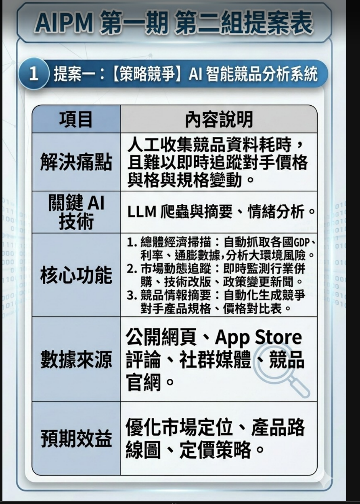

報告架構 (Deliverables)
一、產品需求文件 (PRD)
包含市場分析、用戶畫像、功能規格
（須註明哪些部分由 AI 協助生成）
二、技術架構與流程圖
使用 Mermaid 繪製
需包含 RAG 知識庫或 RPA 工作流
三、互動式產品原型 (MVP)
透過 Vibe Coding 工具
（如 Antigravity / Firebase Studio）
開發之可操作 Demo
四、專題成果展示
解決痛點與產品商業價值說明
（對外：如客戶體驗改善
　對內：如效率提升的量化效益）
Live Demo（必須是「可互動」的展示）